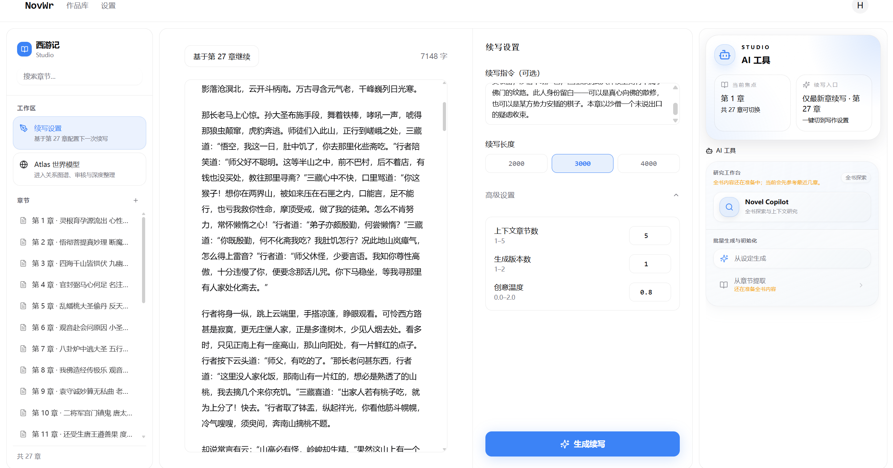

<div align="center">

# NovelWriter / NovWr

**让代码组装上下文，让模型负责生成，让作者保留最终判断权。**

一个面向**长篇小说创作 / 续写**的 AI 写作工具。  
它不只是“续写下一段”，而是通过可维护的**世界模型**（实体、关系、体系）和可审计的工作流，让生成结果更一致、更可控。

[](https://github.com/Hurricane0698/novelwriter/stargazers)
[](LICENSE)
[](https://fastapi.tiangolo.com/)
[](https://react.dev/)
[](https://www.docker.com/)

</div>



## 为什么做这个项目

很多 AI 写作工具的思路是：让模型分析剧情、规划走向、评审质量、最后再生成文本。  
但在长篇小说里，真正棘手的往往不是“生成速度”，而是：

- 这段内容要不要？
- 它有没有偏离世界观？
- 角色说话还像不像他自己？
- 当作品写到几十万字时，应该把**哪些上下文**喂给模型？

NovelWriter 的核心思路很克制：

- **代码做确定性的事**：上下文组织、索引、状态管理、写入流程
- **LLM 做擅长的事**：自然语言生成、阅读、归纳
- **人保留决定权**：AI 输出永远是草稿，最终是否采纳由作者判断

换句话说，它不是想“替你写小说”，而是想把**试、看、改、再试**这个循环做得足够快、足够便宜、足够可控。

---

## 核心亮点

### 1. 世界模型驱动，而不是把整本书硬塞给模型

NovelWriter 不依赖“全书大总结”来续写，而是维护一套可编辑的世界模型：

- **实体**：角色、地点、物品、概念……
- **关系**：人物关系、组织从属、因果联系……
- **体系**：势力结构、修炼系统、规则约束……

续写时，系统会按当前章节和指令，自动注入**真正相关**的设定，而不是把所有内容一股脑丢给模型。

### 2. 统一工作区：写作与世界观维护不断线

长篇创作里，写正文和改设定本来就是交替发生的。

新版工作区把日常写作（Studio）和世界模型治理（Atlas）统一进同一个 Shell：

- 切换时**位置不丢**
- Copilot 对话**不断线**
- 编辑内容有**保存兜底**
- 路由状态可恢复、可分享、可前进后退

这不是简单换皮，而是把“写作”和“治理”放回同一个工作流。

### 3. 只读的 Novel Copilot：不像黑箱，更像助手

我没有让 Agent 直接“全量总结整本书”，而是让它像人一样逐步缩小范围：

- **Find**：先找相关内容出现在哪里
- **Open**：再打开最可能有设定变化的内容包
- **Read**：最后只精读关键段落

Copilot 只负责**阅读、检索、归纳和提出建议**，不会静默改库。  
你看到的是一张张待审核建议卡，而不是一个背地里替你做决定的黑箱系统。

### 4. 自部署优先，BYOK

- 支持 Docker 部署
- 支持任意 OpenAI 兼容接口
- 你可以使用 OpenAI / Gemini / DeepSeek / 本地转发服务等
- 数据留在你自己的环境里

目前项目更偏向 **self-host / BYOK** 使用方式，而不是 SaaS 托管。

---

## 功能概览

| 模块 | 说明 |
|---|---|
| 世界模型 | 实体 / 关系 / 体系统一建模，支撑长篇创作 |
| 章节续写 | 流式生成，多版本对比，快速试错 |
| Bootstrap | 从已有文本提取世界模型，降低冷启动成本 |
| Worldpack | 设定导入 / 导出，便于复用和分享 |
| 世界模型编辑器 | 可视化管理设定、关系、结构体系 |
| Novel Copilot | 基于 Find / Open / Read 的渐进式披露建议流 |
| 叙事约束 | 用体系级规则约束输出风格与世界观 |
| 连接预检 | 检查流式输出 / JSON 模式兼容性，提前暴露问题 |

---

## 适合什么人

- 在写**长篇小说 / 网文 / 同人 / 系列故事**
- 觉得“AI 很会写，但老是设定漂移”
- 不想把创作决策全部交给自动 Agent
- 希望自己掌控世界观，同时降低维护摩擦
- 想自部署，或希望使用自己的模型 API

如果你要的是“一键自动写完整本小说”的黑箱工具，那这个项目大概率不是为你设计的。  
如果你更关心**上下文、设定一致性、可控性**，那它可能会比较对味。

---

## 快速开始

### Docker 部署（推荐）

```bash
git clone https://github.com/Hurricane0698/novelwriter.git
cd novelwriter
cp .env.example .env
# 编辑 .env，填入你的 LLM API 配置
docker compose up -d
```

然后打开：

```text
http://localhost:8000
```

### 部署说明

- 推荐使用 Docker / Docker Compose
- 至少需要一个可用的 LLM API Key
- 支持任意 OpenAI 兼容接口
- 设置页里的“测试连接”会检测基础连通性、流式输出和 JSON 模式兼容性

> 注：目前**没有长期维护的官方托管版**，README 以自部署 / BYOK 为准。

---

## 本地开发

### 后端

```bash
python -m venv .venv
source .venv/bin/activate
pip install -r requirements.txt
cp .env.example .env
# 编辑 .env
uvicorn app.main:app --reload --port 8000
```

### 前端

```bash
cd web
npm install
npm run dev
```

前端开发服务器默认运行在 `http://localhost:5173`。

---

## 环境变量

| 变量 | 必填 | 说明 |
|---|---|---|
| `OPENAI_API_KEY` | 是 | LLM API 密钥 |
| `OPENAI_BASE_URL` | 否 | API 地址，可替换为任意兼容接口 |
| `OPENAI_MODEL` | 否 | 默认使用的模型名称 |
| `JWT_SECRET_KEY` | 生产环境必填 | JWT 签名密钥，请使用随机长字符串 |
| `DATABASE_URL` | 否 | 数据库地址，默认 SQLite |

完整配置见 [`.env.example`](.env.example)。

---

## 技术栈

| 层 | 技术 |
|---|---|
| 后端 | FastAPI · SQLAlchemy · SQLite / PostgreSQL |
| 前端 | React 19 · TypeScript · Tailwind CSS · React Query |
| AI 集成 | OpenAI 兼容 API |
| 部署 | Docker · Docker Compose |

---

## 项目结构

```text
app/              # FastAPI 后端
  api/            # 路由层
  core/           # 业务逻辑（生成、上下文组装、Bootstrap）
  models.py       # SQLAlchemy 数据模型
  config.py       # 配置管理
web/              # React 前端
  src/pages/      # 页面组件
  src/components/ # UI 组件
data/             # 数据文件（Worldpack、演示数据）
tests/            # 后端测试
scripts/          # 工具脚本
```

---

## 公开仓说明

这个 GitHub 仓库现在作为**公开发布仓**使用，不再同步私有主仓的每一次开发提交。

- 私有主仓：日常开发、重构、实验、内部流程
- 公开发布仓：提供稳定版本、安装说明，并接收结构化反馈
- `main`：公开可见的连续发布历史，不代表私有仓的实时开发分支
- 公开仓会保留**经过 sanitize 后仍然对公开内容有差异的提交**
- 只改内部文件的私有提交不会进入公开仓历史
- `v*` 标签表示一次明确的公开发布版本，便于定位 bug 和回报问题

---

## 反馈与协作

- **Bug 报告**：欢迎提 Issue，尽量附上版本号、部署方式、复现步骤和日志
- **功能建议**：欢迎说明你的创作场景、当前痛点和理想行为
- **Pull Request**：小范围修复欢迎直接提；较大改动建议先开 Issue 对齐方向

如果你觉得这个项目有点意思，欢迎点个 **Star**。  
对独立开发者来说，这类反馈非常重要。

---

## License

本项目基于 [AGPLv3](LICENSE) 许可证开源。
